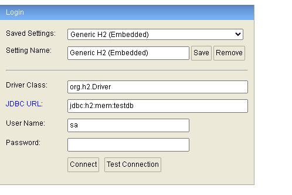

# Hitachi Digital Drone

## Description
Hitachi Digital Drone REST API is responsible delivering medications using drones.

## Local Setup
### Pre-Requisites
- IDE: Eclipse/Intellj
- Database: H2 Database
- Build Tool: Gradle

### Running the API Locally
1. Import project to IDE
2. Build Gradle project (via IDE or via Terminal - "./gradlew build"
3. Run HitachiDigitalDroneApplication main class

### Sample Process/Flow of a transaction

* Once application is started and running, go to Postman or any other api testing tools and run POST Register Drone to register a drone.
* Run GET All Drones Available API to check the saved drone and to get the drone id to be used for adding medication on that specific drone
* If you want to check the h2 database, you can connect on local http://localhost:8083/h2 in browser and Click Connect
* 
* Run POST Load Drone Medications to add medications on a specific drone
* Run GET Drone Information to check the information of the drone(state, weight limit, battery, etc.)
* Note: for the scheduler I used for transition of drone state from LOADING, LOADED, DELIVERING, DELIVERED, RETURNING, and back to IDLE have different timings
  * state will be changed to LOADED(from LOADING) after 60secs when the drone state becomes LOADED(when we first load the first medication).
  * state will be changed to DELIVERING(from LOADED) after 120 secs.
  * state will be changed to DELIVERED(from LOADED) after 180 secs.
  * state will be changed to RETURNING(from DELIVERED) after 240 secs.
  * state will be changed to IDLE(from RETURNING) after 300 secs, and will decreased the battery percentage for about 20%.
